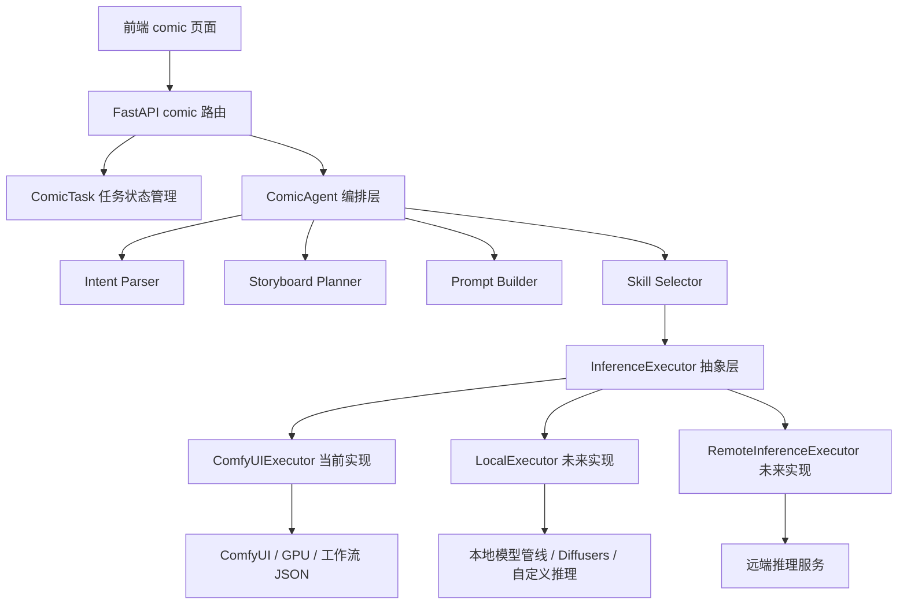

# ComicAgent 移植到本地研究

> 目标：回答两个核心问题：
> 1. `ComicAgent` 能否移植到 ttsapp 本地。
> 2. 移植后能否直接去掉 `ComfyUI` 的工作流接口，或者最少保留到什么程度。

---

## 一、先说结论

### 结论 1：`ComicAgent` 可以移植到 ttsapp 本地

可以，但要分清楚你要移植的是哪一层：

- **可以直接移植的部分**
  - 意图解析
  - 分镜规划
  - 提示词生成
  - 工作流选择策略
  - 任务编排逻辑

- **不能直接“凭空本地化”的部分**
  - 图像生成
  - 图像编辑
  - 图生视频
  - 人脸保持

因为这些能力当前不是 `ComicAgent` 自己完成的，而是交给 **ComfyUI + 工作流 JSON + GPU 模型** 执行。

所以准确说法不是：
**“把 ComicAgent 搬过来后就能独立生成漫剧”**，
而是：
**“把 ComicAgent 作为编排层搬到 ttsapp 本地完全可行，但它仍然需要一个推理执行器。”**

### 结论 2：不能直接把 ComfyUI 工作流接口完全去掉

当前架构下，**不能直接去掉**。

原因很简单：
当前 `ComicAgent` 只是“决策者 + 编排者”，真正执行生成的是：

- `ComfyUIClient.upload_image()`
- `ComfyUIClient.submit_workflow()`
- `ComfyUIClient.wait_result()`
- `ComfyUIClient.download_output()`
- `ComfyUIClient.run_workflow()`
- `ComfyUIClient.run_workflow_video()`

如果把这一层接口直接删掉，就等于：

- 没人接收 workflow JSON
- 没人提交模型推理任务
- 没人轮询结果
- 没人下载图片/视频输出

结果就是 `ComicAgent` 只能产出“分镜和提示词”，不能产出真正图片和视频。

### 结论 3：可以去掉“ComfyUI 这个产品形态”，但不能去掉“工作流执行层”

这是最关键的判断。

你可以考虑：

- **去掉 ComfyUI 的界面和节点编辑器依赖**
- **弱化 ComfyUI 的对外暴露方式**
- **把 ComfyUI 包成内部适配器，只保留最小调用接口**

但你不能直接去掉：

- 工作流模板
- 参数注入机制
- 模型推理编排
- 图像/视频执行引擎

也就是说，**可以替换 ComfyUI 的“外壳”，不能直接删除“执行器职责”。**

---

## 二、当前代码的真实耦合结构

## 2.1 `ComicAgent` 当前职责

从现有代码看，`ComicAgent` 做了 6 件事：

```text
1. 解析用户意图
2. 规划分镜
3. 生成提示词
4. 选择工作流
5. 上传参考图
6. 调用工作流生成图片/视频
```

其中：

- 前 4 件偏“智能编排”
- 后 2 件偏“推理执行”

## 2.2 真实依赖链

当前初始化方式：

```text
comic_agent = ComicAgent(
    comfyui_client=comfyui_client,
    llm_client=llm_client,
)
```

说明 `ComicAgent` 显式依赖两类外部能力：

- **LLM Client**
  - 用于意图解析、分镜规划、提示词生成
- **ComfyUI Client**
  - 用于上传图片、提交工作流、轮询结果、下载输出

也就是说：

```text
ComicAgent = LLM 编排层 + ComfyUI 执行调用层
```

## 2.3 关键耦合点

### 耦合点 1：`agent.py` 直接依赖 `ComfyUIClient`

```text
from app.core.comfyui_client import ComfyUIClient
```

并且在 `generate()`、`edit_image()`、`animate_image()` 内直接调用：

- `upload_image`
- `run_workflow`
- `run_workflow_video`

这不是“松耦合插件式调用”，而是**直接依赖某个具体执行器实现**。

### 耦合点 2：`workflow_selector.py` 直接依赖 JSON 工作流模板

当前逻辑不是抽象的“技能路由”，而是：

- 先选 `workflow_name`
- 再 `load_workflow(workflow_name)`
- 再 `inject_params(...)`

这意味着目前的技能表达方式本质上是：

```text
技能 = 某个 ComfyUI JSON 工作流 + 参数注入规则
```

### 耦合点 3：输出格式完全按照 ComfyUI 返回结构设计

例如：

- 图像输出读取 `outputs[*].images[0].filename`
- 视频输出读取 `outputs[*].videos[0].filename`
- 或 `outputs[*].gifs[0].filename`

这说明当前结果回传协议也是 **ComfyUI 专属协议**。

---

## 三、如果把 ComicAgent 移植到本地，哪些东西可以原样保留

以下模块基本都可以保留在 ttsapp 本地：

### 1. `ComicRequest` / `ComicResult`

这是业务层数据结构，适合作为本地标准接口。

### 2. `intent_parser.py`

这是纯 LLM 编排逻辑，本地保留没有问题。

### 3. `story_planner.py`

也是纯 LLM 编排逻辑，本地保留没有问题。

### 4. `prompt_builder.py`

属于提示词工程，本地保留没有问题。

### 5. `workflow_selector.py` 的一部分

可以保留：

- 风格到技能的路由策略
- 参数注入思路
- 工作流选择映射

但需要重构：

- 不要再把“技能选择”与“ComfyUI JSON 文件名”绑定得太死

更合理的方向是：

```text
select_skill(style, need_face) -> skill_id
skill_id -> executor template / workflow template / inference recipe
```

### 6. `api/v1/comic.py`

任务路由、数据库状态流转、本地文件存储都可以保留。

---

## 四、哪些东西不能直接原样保留

### 1. 不能去掉推理执行器

当前 `ComicAgent` 本身不做：

- Stable Diffusion 推理
- InstantID 推理
- Wan I2V 推理
- Qwen Edit 推理

它只是组织这些模型的调用过程。

如果本地化以后不再使用 ComfyUI，就必须换成另一个执行器，例如：

- 自己写 Python 推理管线
- 用 Diffusers + 自定义节点编排
- 用内部推理服务替代 ComfyUI
- 用独立模型服务网关替代 `/prompt` + `/history` + `/view`

### 2. 不能直接删除工作流表达层

你现在所谓“去掉 ComfyUI 工作流接口”，其实可能包含两层意思：

#### 情况 A：去掉 ComfyUI 的 HTTP API，但保留工作流思想

这个是可行的。

做法是：

- 把 JSON 工作流改造成 Python 原生 pipeline 配置
- 由本地执行器直接吃这些配置
- Agent 仍然只管选 skill 和注入参数

#### 情况 B：连工作流层都不要了，直接让 Agent 自己调模型

这个不太现实。

因为一旦去掉工作流层，`ComicAgent` 就要自己知道：

- 该加载哪个底模
- 该加载哪个 LoRA
- 人脸保持怎么接
- 哪些节点顺序执行
- 图生视频怎么串
- 输出怎么取

这样 `ComicAgent` 就从“编排层”变成“模型执行引擎”，职责会严重膨胀。

这不符合当前系统结构，也不利于后续维护。

---

## 五、你真正可以考虑的三种方案

## 方案 A：保留 ComicAgent，继续使用 ComfyUI，但只把它当内部执行器

### 做法

- `ComicAgent` 完整放到 ttsapp 本地
- 保留 `ComfyUIClient`
- 保留工作流 JSON
- 前端和业务层不再直接暴露 ComfyUI 概念
- 所有调用都通过 ttsapp 后端完成

### 优点

- 迁移成本最低
- 兼容现有工作流资产
- 不需要重写模型推理逻辑
- 风险最小，能最快上线

### 缺点

- 底层还是依赖 ComfyUI
- 调试复杂度仍然存在
- 工作流维护仍需要理解节点图

### 适用场景

- 你当前要尽快把漫剧能力并入 ttsapp
- 先求可用，再逐步重构

## 方案 B：保留 ComicAgent，抽象出统一执行器接口，先兼容 ComfyUI，后续可替换

这是我最推荐的方案。

### 核心思想

把现在的：

```text
ComicAgent -> 直接调用 ComfyUIClient
```

改成：

```text
ComicAgent -> 调用 InferenceExecutor 抽象接口
```

例如：

```text
InferenceExecutor
├── ComfyUIExecutor
├── LocalDiffusersExecutor
└── RemoteInferenceExecutor
```

### 这样拆分后

- `ComicAgent` 只负责：
  - 意图解析
  - 分镜规划
  - 提示词生成
  - 技能选择
- `Executor` 负责：
  - 上传素材
  - 组织推理参数
  - 执行图像/视频生成
  - 返回统一输出结构

### 优点

- 架构最清晰
- 后面可以逐步摆脱 ComfyUI
- 方便本地执行、远端执行、混合执行并存
- 便于测试和维护

### 缺点

- 需要做一次中等规模重构
- 要重新定义统一的推理任务协议

### 适用场景

- 你希望漫剧能力成为 ttsapp 的长期核心模块
- 你不想以后一直被 ComfyUI 绑死

## 方案 C：完全去掉 ComfyUI，改为纯 Python 本地推理引擎

### 做法

- 重写 `ComfyUIClient`
- 重写 workflow 表达层
- 重写图像/视频 pipeline 编排
- 用 Diffusers / Transformers / 自己的推理脚本替代当前工作流 JSON

### 优点

- 理论上最彻底
- 完全掌控推理流程
- 不再依赖 ComfyUI 协议和节点生态

### 缺点

- 成本极高
- 风险极高
- 工作量远大于“移植 Agent”本身
- 很多现成工作流能力要重新实现
- Wan / InstantID / 各类节点组合迁移难度不低

### 适用场景

- 你准备长期建设自己的多模态推理平台
- 有足够时间做底层工程化
- 不是近期交付目标

---

## 六、从当前项目出发，我的判断

如果你的目标是：

- **尽快把漫剧服务接入 ttsapp**
- **保留现有 71 个工作流资产价值**
- **不想现在就重写所有模型推理链路**

那么不应该直接删掉 ComfyUI 工作流接口。

### 最合理的落地结论

应该做的是：

- **把 ComicAgent 完整移植进 ttsapp 主业务结构**
- **把 ComfyUI 降级为底层执行器，而不是产品主接口**
- **在 ComicAgent 和 ComfyUI 之间增加一层执行器抽象**

即：

```text
前端 / 路由 / 任务系统
    ↓
ComicAgent（编排层）
    ↓
InferenceExecutor（抽象执行层）
    ↓
ComfyUIExecutor（当前实现）
```

这样未来你要换成：

- 本地 Diffusers
- 本地 Flux 管线
- 远端自建推理服务

都不会动到 `ComicAgent` 的主逻辑。

---

## 七、建议的目标架构



这个结构的价值是：

- `ComicAgent` 不再绑定某个具体推理后端
- 你可以逐步替换执行器，而不是一次性推翻现有能力

---

## 八、建议的重构步骤

### 第一步：先把 `ComicAgent` 从 `ComfyUIClient` 直接依赖中解耦

目标：

```text
ComicAgent(comfyui_client, llm_client)
↓
ComicAgent(executor, llm_client)
```

### 第二步：定义统一执行接口

接口至少需要覆盖这些能力：

- 执行静态图生成
- 执行图像编辑
- 执行图生视频
- 上传输入图片
- 返回统一结果结构

### 第三步：现阶段先实现 `ComfyUIExecutor`

即：

- 内部仍然调用 `/upload/image`
- `/prompt`
- `/history/{id}`
- `/view`

但对 `ComicAgent` 来说，它不再感知这些细节。

### 第四步：把 `workflow_selector` 升级成 `skill_selector`

从：

```text
style + has_face -> workflow_name
```

升级为：

```text
style + has_face + task_type -> skill_id
skill_id -> executor template
```

### 第五步：等业务稳定后，再评估是否真的替换掉 ComfyUI

只有在下面这些条件成立时，才建议真正去 ComfyUI：

- 你已经明确长期维护自研推理引擎
- 关键工作流已经能被 Python 原生 pipeline 稳定复现
- 团队能承担模型加载、调度、显存管理、视频链路维护成本

---

## 九、最终建议

### 短期建议

- **移植 ComicAgent 到 ttsapp：可以，建议立即做**
- **直接删除 ComfyUI 工作流接口：不建议**
- **正确做法：先抽象执行层，再把 ComfyUI 藏到执行层后面**

### 中期建议

- 把“工作流”从 `JSON 文件名` 升级为“技能定义”
- 让 Agent 面向 `skill_id` 编排，而不是面向 `xianxia_basic.json` 编排

### 长期建议

- 如果漫剧能力成为核心产品，再逐步评估是否替换 ComfyUI 为自研推理引擎
- 但这个阶段属于“平台化建设”，不是“简单移植 Agent”

---

## 十、一句话结论

**`ComicAgent` 完全可以移植到 ttsapp 本地，但它本质上只是编排层，不能直接替代 ComfyUI 这类推理执行层；正确方向不是粗暴去掉工作流接口，而是把 ComfyUI 收敛到一个可替换的执行器抽象后面。**
