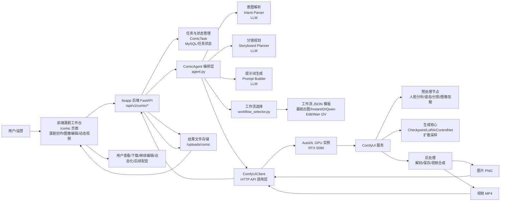
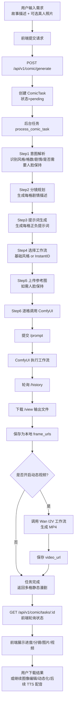
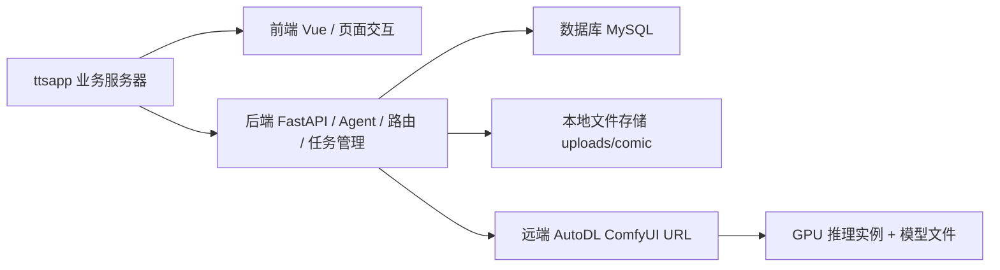

# 真人漫剧服务整体架构流程图

> 目标：帮助你从**全局视角**理解“真人漫剧服务”当前的系统分层、核心调用链、外部依赖与结果回传路径。

---

## 一、整体架构总览



---

## 二、端到端主流程图



---

## 三、系统分层理解

### 1. 用户交互层

- **前端漫剧工作台**
  - 负责收集故事描述、格数、人脸参考图。
  - 展示生成进度、分镜文本、每格结果图、视频结果。
  - 承担“继续编辑”“继续动态化”“后续配音”的入口。

### 2. 业务接口层

- **FastAPI 路由层**
  - 已有核心接口：
    - `POST /api/v1/comic/generate`
    - `GET /api/v1/comic/tasks/{id}`
    - `GET /api/v1/comic/health`
    - `POST /api/v1/comic/edit`
    - `POST /api/v1/comic/animate`
  - 负责鉴权、创建任务、启动后台处理、返回任务状态。

### 3. 任务管理层

- **ComicTask + 数据库**
  - 存储任务状态：`pending` / `processing` / `completed` / `failed`
  - 存储生成描述、分镜、提示词、图片 URL、视频 URL、错误信息。
  - 是前后端协作的“状态中枢”。

### 4. Agent 编排层

- **ComicAgent** 是系统大脑。
  - `intent_parser.py`：理解用户需求。
  - `story_planner.py`：把一句话扩成多格分镜。
  - `prompt_builder.py`：把中文意图转成适合模型的提示词。
  - `workflow_selector.py`：决定该走哪套 ComfyUI JSON 工作流。
  - `agent.py`：串联整个生成流程。

### 5. 推理接入层

- **ComfyUIClient**
  - 通过 HTTP API 调用远端 ComfyUI。
  - 典型交互：
    - 上传参考图：`/upload/image`
    - 提交工作流：`/prompt`
    - 查询历史：`/history/{prompt_id}`
    - 下载结果：`/view`

### 6. GPU 推理层

- **AutoDL RTX 5090 实例上的 ComfyUI 服务**
  - 真正执行图像生成、图像编辑、图生视频等重计算任务。
  - 模型和节点主要都在这里。

### 7. 模型/工作流层

- **工作流 JSON 模板**
  - 基础风格图像：`xianxia_basic.json`、`anime_basic.json`、`blindbox_q.json`、`moxin_ink.json`
  - 人脸保持：`xianxia_instantid.json`
  - 图像编辑：`qwen_edit.json`
  - 图生视频：`wan_i2v.json`

- **模型能力族**
  - 图像生成：Z-Image、Qwen Image、DreamshaperXL、FLUX
  - 人脸保持：InstantID、PuLID
  - 图像编辑：Qwen Image Edit、Klein
  - 视频生成：Wan 2.1/2.2、LTX 2.x

### 8. 结果交付层

- **本地文件存储**
  - 后端将图片/视频落盘到 `/uploads/comic`。
  - 前端通过 `frame_urls` / `video_url` 展示与下载。

---

## 四、按能力拆解的三条主链路

### 1. 真人照片 + 故事描述 → 多格静态漫剧

```text
用户输入故事 + 上传真人照片
→ 前端提交 generate
→ 后端创建任务
→ Agent 解析意图、生成分镜和提示词
→ 选择 InstantID/风格工作流
→ ComfyUI 逐格出图
→ 后端保存图片
→ 前端展示 2/4/6 格漫剧
```

### 2. 已有图片 → 中文指令编辑图像

```text
用户选择已有图片
→ 前端提交 edit
→ 后端创建编辑任务
→ Agent 加载 qwen_edit.json
→ ComfyUI 执行 Qwen Image Edit
→ 输出新图
→ 后端保存并返回编辑结果
```

### 3. 静态图片 → 动态漫剧视频

```text
用户选择某一格图片
→ 前端提交 animate
→ 后端创建动态化任务
→ Agent 加载 wan_i2v.json
→ ComfyUI 执行 Wan I2V
→ 输出 MP4
→ 后端保存视频并返回 video_url
```

---

## 五、当前部署形态的本质



可以把它理解成两块：

- **ttsapp 侧**
  - 管“业务逻辑”：用户、任务、Agent、结果存储、接口。

- **AutoDL/ComfyUI 侧**
  - 管“重计算推理”：模型、工作流、GPU 执行。

也就是说，这套系统本质上是：
**业务层和推理层解耦**，ttsapp 不直接承载大模型推理，而是通过 HTTP 调用远端 ComfyUI 服务。

---

## 六、你需要重点记住的全局认知

- **核心中枢不是前端，也不是 ComfyUI，而是 `ComicAgent`**
  - 它负责把“用户意图”翻译成“可执行工作流调用序列”。

- **ComfyUI 不是业务系统，而是推理执行器**
  - 它擅长执行节点图，不负责用户系统、任务系统、鉴权和产品流程。

- **数据库不是存素材本身，而是存任务状态和结果索引**
  - 这样前端可以轮询任务状态并逐步展示结果。

- **远端 GPU 是当前服务可用性的关键依赖**
  - AutoDL 关机、URL 变化、ComfyUI 不可达，都会直接影响漫剧功能。

- **当前产品路径是先静态图，再编辑，再动态化，最后再接 TTS 配音**
  - 这说明静图生成是第一优先级能力，视频化和配音是逐步叠加的扩展层。

---

## 七、当前架构的优势与瓶颈

### 优势

- **业务与推理解耦**：后端逻辑和模型工作流分层清晰。
- **扩展性强**：新增风格/编辑/视频能力，本质是增加工作流与路由。
- **可复用已有 ttsapp 能力**：后续容易接入 TTS、数字人、播客等现有模块。

### 瓶颈

- **ComfyUI 单队列特性明显**：并发时容易排队。
- **视频生成耗时长**：Wan I2V 不适合实时交互。
- **AutoDL URL/实例状态是单点依赖**。
- **人脸保持与风格化之间仍需平衡**：相似度、风格一致性、速度无法同时最优。

---

## 八、一句话总结

这套“真人漫剧服务”的整体架构可以概括为：

**前端负责交互，FastAPI 负责任务和业务编排，ComicAgent 负责把自然语言需求转成工作流，ComfyUI 负责在 AutoDL GPU 上真正执行图像/视频生成，最后由后端存储结果并回传前端展示。**
