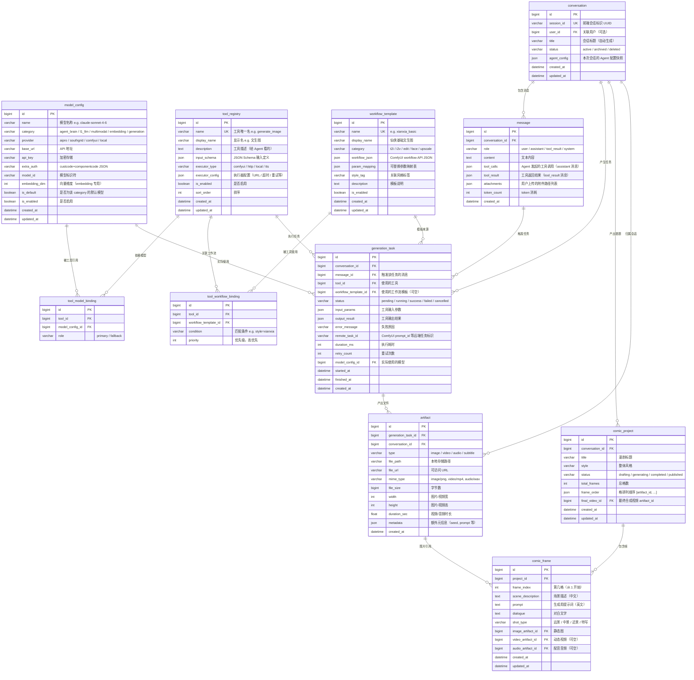

# 自动化漫剧 Agent 设计

> 核心理念：**模型是模型，Agent 是 Agent。**
> Agent 是大脑（Claude 4.6），模型推理服务是工具。
> Agent 通过对话理解需求，自主规划，调用工具，循环执行，最终交付完整漫剧。

---

## 一、现有 ComicAgent 的问题

现有 `ComicAgent` 不是 Agent，是一个**硬编码 pipeline**：

```text
Step1 解析意图 → Step2 分镜 → Step3 提示词 → Step4 选工作流 → Step5 出图 → Step6 视频
```

问题：

- **没有推理循环**：不会根据中间结果调整策略
- **没有工具调用协议**：直接硬编码调用 ComfyUI 函数
- **没有对话能力**：用户只能填表单，不能聊天交互
- **没有自主决策**：所有步骤写死，不会根据小说内容自己判断需要几格、什么风格、是否需要人脸
- **LLM 只做翻译**：现有 LLM 只被当成"中文转英文提示词"的翻译器，没有发挥推理能力

**结论：现有 ComicAgent 需要重新设计，不是移植。**

---

## 二、真正的自动化漫剧 Agent 是什么

### 2.1 一句话定义

用户通过对话输入一段小说或故事描述，Agent（Claude 4.6）自主完成：

- 理解故事
- 规划分镜
- 选择风格
- 调用图像生成工具
- 检查生成质量
- 调用视频生成工具
- 调用配音工具
- 组装最终漫剧

**整个过程是 Agent 自主驱动的，不是写死的流水线。**

### 2.2 核心区别

| | 现有 ComicAgent | 真正的自动化漫剧 Agent |
|---|---|---|
| **大脑** | 写死的 Python 代码 | Claude 4.6 |
| **决策** | 硬编码 if-else | LLM 推理 + function calling |
| **交互** | 表单提交 | 对话式 |
| **工具** | 直接调用 ComfyUI 函数 | 通过 tool/skill 协议调用 |
| **循环** | 无，一次性执行 | 有，观察-思考-行动循环 |
| **纠错** | 无 | Agent 可以检查结果、重试、调整参数 |
| **扩展** | 改代码 | 加 tool 定义 |

---

## 三、Agent 架构设计

### 3.1 整体架构

```text
┌─────────────────────────────────────────────────────────┐
│                      用户对话层                          │
│  用户输入小说/故事/指令 ←→ Agent 回复进度/结果/追问       │
└───────────────────────┬─────────────────────────────────┘
                        │
                        ▼
┌─────────────────────────────────────────────────────────┐
│                  Agent 核心（Claude 4.6）                │
│                                                         │
│  系统提示词（角色定义 + 工具说明 + 输出规范）              │
│                                                         │
│  Agent Loop:                                            │
│    1. 接收用户消息 / 工具返回结果                         │
│    2. 思考：分析当前状态，决定下一步                      │
│    3. 行动：调用工具 / 回复用户 / 结束任务                │
│    4. 回到 1                                            │
│                                                         │
│  工具调用方式：Claude function calling / tool_use         │
└───────────────────────┬─────────────────────────────────┘
                        │
                        ▼
┌─────────────────────────────────────────────────────────┐
│                    工具层（Skills）                       │
│                                                         │
│  每个工具 = 一个独立能力，Agent 按需调用                  │
│                                                         │
│  ┌──────────────┐  ┌──────────────┐  ┌──────────────┐  │
│  │ 图像生成      │  │ 图像编辑      │  │ 图生视频      │  │
│  │ generate_img  │  │ edit_image    │  │ img_to_video  │  │
│  └──────┬───────┘  └──────┬───────┘  └──────┬───────┘  │
│         │                 │                 │           │
│  ┌──────────────┐  ┌──────────────┐  ┌──────────────┐  │
│  │ 人脸保持生成  │  │ TTS 配音     │  │ 视频拼接      │  │
│  │ face_gen     │  │ text_to_speech│  │ merge_video   │  │
│  └──────┬───────┘  └──────┬───────┘  └──────┬───────┘  │
│         │                 │                 │           │
│  ┌──────────────┐  ┌──────────────┐  ┌──────────────┐  │
│  │ 图像超分      │  │ 背景音乐     │  │ 字幕叠加      │  │
│  │ upscale_img  │  │ add_bgm      │  │ add_subtitle  │  │
│  └──────────────┘  └──────────────┘  └──────────────┘  │
└───────────────────────┬─────────────────────────────────┘
                        │
                        ▼
┌─────────────────────────────────────────────────────────┐
│                  推理执行层（可替换）                      │
│                                                         │
│  ComfyUI（当前）/ Diffusers / 远端推理服务 / 第三方 API   │
│  Fish-Speech TTS / 其他 TTS 服务                         │
│  FFmpeg 视频处理                                         │
│                                                         │
│  → 工具层不关心底层用什么引擎                             │
│  → Agent 更不关心，它只知道"调用工具，拿到结果"            │
└─────────────────────────────────────────────────────────┘
```

### 3.2 核心原则

- **Agent 只做决策和规划**
  - 不写死任何步骤顺序
  - 不硬编码风格选择
  - 不固定格数

- **工具只做执行**
  - 每个工具有清晰的输入/输出定义
  - 工具不知道上下文，不知道自己是被谁调用的
  - 工具可以独立测试

- **Agent 和工具之间通过标准协议通信**
  - 用 Claude 的 tool_use / function calling
  - 工具定义 = JSON Schema
  - 工具返回 = 结构化结果

---

## 四、Agent 核心设计

### 4.1 系统提示词（System Prompt）

```text
你是一个专业的漫剧创作 Agent。

你的能力：
- 分析用户提供的小说、故事或创意描述
- 自主规划漫剧分镜（场景、构图、角色、情绪）
- 为每个分镜生成专业的图像提示词
- 调用图像生成工具产出每一格漫画
- 检查生成结果，不满意则调整参数重试
- 调用视频工具让静态漫画动起来
- 调用配音工具为角色配音
- 最终交付完整的漫剧作品

你的工作方式：
1. 先理解用户需求（风格偏好、故事内容、特殊要求）
2. 制定分镜计划，和用户确认（或直接执行，取决于用户偏好）
3. 逐格生成图像，每格完成后展示给用户
4. 根据需要进行后续处理（视频化、配音、字幕）
5. 交付最终结果

工具使用规范：
- 你可以并行调用多个独立工具
- 如果工具返回错误，分析原因并调整参数重试
- 如果生成结果不符合预期，可以调整提示词重新生成
- 始终用中文和用户交流
```

### 4.2 Agent Loop 设计

```text
用户: "把这段小说变成漫剧：李逍遥初入仙灵岛，雨中邂逅赵灵儿..."

Agent 思考: 
  → 这是一个仙侠题材的故事
  → 适合仙侠风格
  → 关键场景：雨中、仙灵岛、初次相遇
  → 建议 4~6 格
  → 需要两个角色的一致性

Agent 回复: "我来帮你把这段故事变成漫剧。我的规划是..."
  → 同时展示分镜计划

Agent 调用工具: generate_image(prompt="...", style="xianxia", ...)
  → 拿到第 1 格

Agent 思考:
  → 第 1 格效果不错，构图合理
  → 继续第 2 格

Agent 调用工具: generate_image(prompt="...", style="xianxia", ...)
  → 拿到第 2 格

...（循环直到所有格完成）

Agent 思考:
  → 所有静态图完成
  → 用户没有明确说要视频，我问一下

Agent 回复: "6 格漫剧已生成完毕。需要我把它们动态化吗？"

用户: "好的，加上配音"

Agent 调用工具: img_to_video(...) + text_to_speech(...)
  → 拿到视频和音频

Agent 调用工具: merge_video(...)
  → 最终合成

Agent 回复: "完整漫剧已生成，请查看 ▶"
```

### 4.3 与现有 ComicAgent 的本质区别

现有 ComicAgent 的执行方式：

```python
# 写死的 pipeline，不会思考
intent = await parse_intent(description, llm)      # LLM 只做翻译
storyboard = await plan_storyboard(story, ...)      # LLM 只做翻译
prompts = await build_all_prompts(storyboard, ...)  # LLM 只做翻译
workflow = select_workflow(style, need_face)         # 硬编码映射
for prompt in prompts:
    frame = await comfyui.run_workflow(workflow)     # 直接调用
```

真正的 Agent 执行方式：

```python
# Agent 自主决策，工具按需调用
while not task_complete:
    # Claude 4.6 根据当前上下文决定下一步
    response = await claude.messages.create(
        model="claude-sonnet-4-20250514",
        system=SYSTEM_PROMPT,
        messages=conversation_history,
        tools=TOOL_DEFINITIONS,
    )
    
    if response.stop_reason == "tool_use":
        # Agent 决定调用某个工具
        for tool_call in response.tool_calls:
            result = await execute_tool(tool_call)
            conversation_history.append(tool_result)
    
    elif response.stop_reason == "end_turn":
        # Agent 决定回复用户（展示结果/追问/完成）
        send_to_user(response.content)
```

---

## 五、工具（Skill）定义

### 5.1 工具定义规范

每个工具用 Claude tool_use 的标准 JSON Schema 定义：

```json
{
  "name": "tool_name",
  "description": "工具做什么，什么时候用",
  "input_schema": {
    "type": "object",
    "properties": { ... },
    "required": [ ... ]
  }
}
```

### 5.2 核心工具清单

#### Tool 1: `generate_image` — 文生图

```json
{
  "name": "generate_image",
  "description": "根据文字描述生成一张图像。支持多种风格：xianxia(仙侠)、ink(水墨)、blindbox(盲盒Q版)、anime(动漫)、realistic(写实)。返回图像文件路径。",
  "input_schema": {
    "type": "object",
    "properties": {
      "prompt": {
        "type": "string",
        "description": "英文图像生成提示词，描述画面内容、构图、光影、氛围"
      },
      "negative_prompt": {
        "type": "string",
        "description": "英文负面提示词，描述不想出现的元素"
      },
      "style": {
        "type": "string",
        "enum": ["xianxia", "ink", "blindbox", "anime", "realistic"],
        "description": "画面风格"
      },
      "width": { "type": "integer", "default": 1024 },
      "height": { "type": "integer", "default": 1024 },
      "seed": { "type": "integer", "default": -1, "description": "-1为随机" }
    },
    "required": ["prompt", "style"]
  }
}
```

#### Tool 2: `generate_image_with_face` — 人脸保持文生图

```json
{
  "name": "generate_image_with_face",
  "description": "生成保留指定人脸特征的图像。需要先有一张人脸参考图。用于让漫剧中的角色保持面貌一致。",
  "input_schema": {
    "type": "object",
    "properties": {
      "prompt": { "type": "string", "description": "英文图像提示词" },
      "negative_prompt": { "type": "string" },
      "face_image_path": { "type": "string", "description": "人脸参考图的文件路径" },
      "style": { "type": "string", "enum": ["xianxia", "ink", "anime", "realistic"] },
      "face_strength": { "type": "number", "default": 0.8, "description": "人脸保持强度 0~1" }
    },
    "required": ["prompt", "face_image_path", "style"]
  }
}
```

#### Tool 3: `edit_image` — 自然语言图像编辑

```json
{
  "name": "edit_image",
  "description": "用自然语言指令编辑已有图像。例如：换背景、换服装、换风格、调光影。",
  "input_schema": {
    "type": "object",
    "properties": {
      "source_image_path": { "type": "string", "description": "要编辑的原始图像路径" },
      "instruction": { "type": "string", "description": "编辑指令，中英文均可" }
    },
    "required": ["source_image_path", "instruction"]
  }
}
```

#### Tool 4: `image_to_video` — 图生视频

```json
{
  "name": "image_to_video",
  "description": "将一张静态图像转为 2~5 秒动态视频。适合让漫剧画面动起来。耗时较长（3~6分钟）。",
  "input_schema": {
    "type": "object",
    "properties": {
      "source_image_path": { "type": "string", "description": "源图像路径" },
      "motion_prompt": { "type": "string", "description": "运动描述，例如：头发轻轻飘动，角色缓缓转头" },
      "duration_seconds": { "type": "number", "default": 2, "description": "目标时长（秒）" }
    },
    "required": ["source_image_path", "motion_prompt"]
  }
}
```

#### Tool 5: `text_to_speech` — 文字转语音

```json
{
  "name": "text_to_speech",
  "description": "将文字转为语音音频。可选不同音色。用于漫剧角色配音或旁白。",
  "input_schema": {
    "type": "object",
    "properties": {
      "text": { "type": "string", "description": "要转换的文字" },
      "voice": { "type": "string", "description": "音色标识", "default": "default" },
      "language": { "type": "string", "default": "zh" }
    },
    "required": ["text"]
  }
}
```

#### Tool 6: `upscale_image` — 图像超分

```json
{
  "name": "upscale_image",
  "description": "将低分辨率图像放大到高清。用于最终输出前的质量提升。",
  "input_schema": {
    "type": "object",
    "properties": {
      "source_image_path": { "type": "string" },
      "scale": { "type": "number", "default": 2, "description": "放大倍数，2 或 4" }
    },
    "required": ["source_image_path"]
  }
}
```

#### Tool 7: `merge_media` — 媒体合成

```json
{
  "name": "merge_media",
  "description": "将多个视频片段、音频、字幕合成为一个完整视频。用于最终漫剧成品输出。",
  "input_schema": {
    "type": "object",
    "properties": {
      "video_paths": { "type": "array", "items": { "type": "string" }, "description": "视频片段路径列表，按顺序拼接" },
      "audio_path": { "type": "string", "description": "配音音频路径（可选）" },
      "bgm_path": { "type": "string", "description": "背景音乐路径（可选）" },
      "subtitle_texts": { "type": "array", "items": { "type": "string" }, "description": "每段对应的字幕文本（可选）" }
    },
    "required": ["video_paths"]
  }
}
```

#### Tool 8: `save_artifact` — 保存/交付文件

```json
{
  "name": "save_artifact",
  "description": "将生成的图片或视频保存到用户可访问的位置，返回下载链接。",
  "input_schema": {
    "type": "object",
    "properties": {
      "file_path": { "type": "string", "description": "要保存的文件路径" },
      "name": { "type": "string", "description": "用户可见的文件名" }
    },
    "required": ["file_path", "name"]
  }
}
```

---

## 六、工具执行层（和 Agent 完全解耦）

Agent 不关心工具内部怎么实现。工具内部可以用任何引擎：

```text
Tool: generate_image
  ├── 实现 A: 调用 ComfyUI API（当前方案）
  ├── 实现 B: 调用本地 Diffusers pipeline
  ├── 实现 C: 调用 Replicate / Midjourney API
  └── 实现 D: 调用自建推理服务

Tool: text_to_speech
  ├── 实现 A: 调用 Fish-Speech（当前 ttsapp 已有）
  ├── 实现 B: 调用 CosyVoice
  └── 实现 C: 调用 Azure TTS API

Tool: image_to_video
  ├── 实现 A: 调用 ComfyUI Wan I2V 工作流
  ├── 实现 B: 调用 Replicate Wan API
  └── 实现 C: 调用 Kling / Runway API
```

这就是为什么"模型是模型，Agent 是 Agent"：

- **Agent（Claude 4.6）决定"做什么"**
- **工具决定"怎么做"**
- **模型是工具内部的实现细节**

---

## 七、后端实现架构

### 7.1 目录结构

```text
backend/app/
├── core/
│   ├── comic_chat_agent/          ← 新的 Agent 模块
│   │   ├── __init__.py
│   │   ├── agent.py               ← Agent Loop 主逻辑
│   │   ├── system_prompt.py       ← 系统提示词
│   │   ├── tool_registry.py       ← 工具注册与定义
│   │   └── tool_executor.py       ← 工具执行分发器
│   │
│   ├── tools/                     ← 具体工具实现
│   │   ├── __init__.py
│   │   ├── generate_image.py      ← 文生图（内部调 ComfyUI 或其他）
│   │   ├── face_generate.py       ← 人脸保持生成
│   │   ├── edit_image.py          ← 图像编辑
│   │   ├── image_to_video.py      ← 图生视频
│   │   ├── text_to_speech.py      ← TTS 配音
│   │   ├── upscale_image.py       ← 超分
│   │   ├── merge_media.py         ← 媒体合成
│   │   └── save_artifact.py       ← 文件保存
│   │
│   ├── comfyui_client.py          ← ComfyUI 客户端（工具内部使用）
│   ├── claude_client.py           ← Claude API 客户端
│   └── llm_client.py              ← 现有 LLM 客户端（保留）
│
├── api/v1/
│   ├── comic_chat.py              ← 对话式漫剧 API
│   └── comic.py                   ← 现有 API（保留兼容）
```

### 7.2 Agent 核心代码骨架

```python
# backend/app/core/comic_chat_agent/agent.py

import anthropic
from .system_prompt import SYSTEM_PROMPT
from .tool_registry import TOOL_DEFINITIONS
from .tool_executor import execute_tool


class ComicChatAgent:
    """对话式漫剧创作 Agent，以 Claude 4.6 为大脑"""

    def __init__(self, claude_client: anthropic.AsyncAnthropic):
        self.claude = claude_client
        self.conversations: dict[str, list] = {}  # session_id -> messages

    async def chat(self, session_id: str, user_message: str, 
                   attachments: list[str] = None) -> AsyncIterator[dict]:
        """
        用户发送一条消息，Agent 返回流式响应。
        响应可能包含：文本回复、工具调用进度、生成结果。
        """
        # 1. 将用户消息加入对话历史
        messages = self.conversations.setdefault(session_id, [])
        content = [{"type": "text", "text": user_message}]
        if attachments:
            for path in attachments:
                content.append({"type": "image", ...})
        messages.append({"role": "user", "content": content})

        # 2. Agent Loop
        while True:
            response = await self.claude.messages.create(
                model="claude-sonnet-4-20250514",
                max_tokens=4096,
                system=SYSTEM_PROMPT,
                messages=messages,
                tools=TOOL_DEFINITIONS,
            )

            # 3. 处理 Agent 的响应
            assistant_content = response.content
            messages.append({"role": "assistant", "content": assistant_content})

            # 如果 Agent 决定调用工具
            if response.stop_reason == "tool_use":
                tool_results = []
                for block in assistant_content:
                    if block.type == "tool_use":
                        # 通知前端：正在执行某工具
                        yield {"type": "tool_start", "tool": block.name, "input": block.input}
                        
                        # 执行工具
                        result = await execute_tool(block.name, block.input)
                        
                        # 通知前端：工具执行完成
                        yield {"type": "tool_done", "tool": block.name, "result": result}
                        
                        tool_results.append({
                            "type": "tool_result",
                            "tool_use_id": block.id,
                            "content": result,
                        })
                
                messages.append({"role": "user", "content": tool_results})
                continue  # 回到 loop，让 Agent 看到工具结果后继续思考

            # 如果 Agent 决定回复用户
            elif response.stop_reason == "end_turn":
                for block in assistant_content:
                    if hasattr(block, "text"):
                        yield {"type": "text", "content": block.text}
                break  # 本轮对话结束，等用户下一条消息
```

### 7.3 工具执行分发器

```python
# backend/app/core/comic_chat_agent/tool_executor.py

from app.core.tools import (
    generate_image,
    face_generate,
    edit_image,
    image_to_video,
    text_to_speech,
    upscale_image,
    merge_media,
    save_artifact,
)

TOOL_HANDLERS = {
    "generate_image": generate_image.execute,
    "generate_image_with_face": face_generate.execute,
    "edit_image": edit_image.execute,
    "image_to_video": image_to_video.execute,
    "text_to_speech": text_to_speech.execute,
    "upscale_image": upscale_image.execute,
    "merge_media": merge_media.execute,
    "save_artifact": save_artifact.execute,
}


async def execute_tool(tool_name: str, tool_input: dict) -> str:
    handler = TOOL_HANDLERS.get(tool_name)
    if not handler:
        return f"错误：未知工具 {tool_name}"
    try:
        result = await handler(**tool_input)
        return result
    except Exception as e:
        return f"工具执行失败: {e}"
```

### 7.4 单个工具实现示例

```python
# backend/app/core/tools/generate_image.py

from app.core.comfyui_client import comfyui_client
from app.core.comic_agent.workflow_selector import load_workflow, inject_params

# 风格到工作流的映射（这是工具内部的实现细节，Agent 不知道也不需要知道）
STYLE_WORKFLOW = {
    "xianxia": "xianxia_basic",
    "ink": "moxin_ink",
    "blindbox": "blindbox_q",
    "anime": "anime_basic",
    "realistic": "z_image_t2i",
}


async def execute(
    prompt: str,
    style: str = "xianxia",
    negative_prompt: str = "",
    width: int = 1024,
    height: int = 1024,
    seed: int = -1,
) -> str:
    """执行文生图，返回图像文件路径"""
    workflow_name = STYLE_WORKFLOW.get(style, "xianxia_basic")
    workflow = load_workflow(workflow_name)
    workflow = inject_params(
        workflow,
        positive_prompt=prompt,
        negative_prompt=negative_prompt,
        seed=seed,
        width=width,
        height=height,
    )
    image_bytes = await comfyui_client.run_workflow(workflow)

    # 保存到本地
    import uuid, os
    filename = f"gen_{uuid.uuid4().hex[:8]}.png"
    filepath = f"/uploads/comic/{filename}"
    os.makedirs(os.path.dirname(filepath), exist_ok=True)
    with open(filepath, "wb") as f:
        f.write(image_bytes)

    return f"图像已生成，路径: {filepath}"
```

---

## 八、API 设计

### 8.1 对话式 API

```python
# backend/app/api/v1/comic_chat.py

@router.websocket("/ws/comic-chat")
async def comic_chat_ws(websocket: WebSocket, db: AsyncSession = Depends(get_db)):
    """WebSocket 对话式漫剧创作"""
    await websocket.accept()
    session_id = str(uuid.uuid4())

    while True:
        data = await websocket.receive_json()
        user_message = data["message"]
        attachments = data.get("attachments", [])

        async for event in comic_chat_agent.chat(session_id, user_message, attachments):
            await websocket.send_json(event)
```

### 8.2 前端交互流程

```text
用户: 输入小说文本 → 发送

前端收到:
  { type: "text", content: "我来分析这段故事..." }
  { type: "text", content: "规划了6格分镜：1.远景仙灵岛..." }
  { type: "tool_start", tool: "generate_image", input: {...} }
  { type: "tool_done", tool: "generate_image", result: "图像已生成，路径: ..." }
  → 前端立即展示第 1 格图片
  { type: "tool_start", tool: "generate_image", input: {...} }
  { type: "tool_done", tool: "generate_image", result: "图像已生成，路径: ..." }
  → 前端立即展示第 2 格图片
  ...
  { type: "text", content: "6格漫剧全部生成完毕！需要动态化吗？" }

用户: "把第3格动态化，加上配音"

前端收到:
  { type: "tool_start", tool: "image_to_video", input: {...} }
  { type: "tool_done", ... }
  { type: "tool_start", tool: "text_to_speech", input: {...} }
  { type: "tool_done", ... }
  { type: "tool_start", tool: "merge_media", input: {...} }
  { type: "tool_done", ... }
  { type: "text", content: "第3格动态视频+配音已完成！" }
```

---

## 九、和现有 ttsapp 的关系

### 9.1 复用的部分

- **ComfyUI Client**：工具内部继续用来调用 ComfyUI，Agent 不感知
- **工作流 JSON**：工具内部继续用，Agent 不感知
- **TTS 能力**：直接包装成 `text_to_speech` 工具
- **数据库/用户系统**：保留
- **文件存储**：保留

### 9.2 新增的部分

- **Claude API Client**：用于 Agent 推理
- **Agent Loop**：核心对话循环
- **Tool Registry**：工具注册和定义
- **WebSocket 对话 API**：替代现有表单式 API
- **对话式前端页面**：聊天界面

### 9.3 可渐进式迁移

```text
阶段 1: 新增对话式 Agent API，和现有表单式 API 并存
阶段 2: 前端新增聊天页面，和现有漫剧工作台并存
阶段 3: 验证 Agent 效果后，逐步让对话式成为主入口
阶段 4: 现有表单式降级为"快速模式"（跳过对话直接生成）
```

---

## 十、一个完整的用户场景走一遍

```text
用户: 帮我把下面这段变成漫剧：
"李逍遥踏入仙灵岛，细雨如丝。穿过竹林小径，他看到一个白衣少女在池边沉睡。
少女醒来，四目相对，李逍遥愣住了。少女微笑：'你是来找灵丹的吧？'"

Agent 思考:
  - 仙侠题材，适合 xianxia 风格
  - 4 个关键场景：踏入仙灵岛 → 穿过竹林 → 看到少女沉睡 → 四目相对对话
  - 需要两个角色保持一致性
  - 用户没提供人脸照片，先用普通生成

Agent 回复:
  "好的！这段仙灵岛邂逅很适合仙侠风格漫剧。我的规划：
   
   格1（远景）：细雨中的仙灵岛入口，李逍遥背影踏入
   格2（中景）：竹林小径，雨丝穿过竹叶，李逍遥侧身行走
   格3（近景）：池边白衣少女沉睡，花瓣散落
   格4（特写）：四目相对，少女微笑，李逍遥愣住
   
   开始生成第 1 格..."

Agent 调用: generate_image(
  prompt="xianxia style, wide shot, a young swordsman entering a mystical island, 
         light rain, misty atmosphere, lush bamboo forest entrance, 
         ancient stone path, ethereal lighting, masterpiece",
  style="xianxia"
)

→ 工具返回: "图像已生成，路径: /uploads/comic/gen_a1b2c3d4.png"
→ 前端展示第 1 格

Agent 回复: "第 1 格完成 ✓ 正在生成第 2 格..."

Agent 调用: generate_image(
  prompt="xianxia style, medium shot, young swordsman walking through bamboo forest path,
         rain drops on bamboo leaves, misty atmosphere, green bamboo corridor,
         cinematic composition, masterpiece",
  style="xianxia"
)

→ ... 继续循环直到 4 格全部完成

Agent 回复:
  "4 格漫剧全部完成！
   
   你可以：
   1. 让某一格动态化（变成视频）
   2. 为角色添加配音
   3. 调整某一格的画面（比如换构图、改表情）
   4. 直接下载全部图片
   
   需要我做什么？"

用户: "第4格动态化，加上少女说话的配音"

Agent 调用: image_to_video(
  source_image_path="/uploads/comic/gen_e5f6g7h8.png",
  motion_prompt="girl slowly opens eyes and smiles, gentle hair movement, 
                 soft breathing, subtle head tilt"
)

Agent 调用: text_to_speech(
  text="你是来找灵丹的吧？",
  voice="female_gentle",
  language="zh"
)

→ 两个工具并行执行

Agent 调用: merge_media(
  video_paths=["/uploads/comic/vid_xxx.mp4"],
  audio_path="/uploads/comic/tts_xxx.wav"
)

Agent 回复: "第 4 格动态视频+配音已完成！可以播放查看 ▶"
```

---

## 十一、关键依赖

| 依赖 | 用途 | 必须性 |
|---|---|---|
| **Claude API** | Agent 大脑（推理、规划、决策） | 必须 |
| **ComfyUI 服务** | 图像/视频生成执行器 | 当前必须，未来可替换 |
| **Fish-Speech** | TTS 配音 | 可选（ttsapp 已有） |
| **FFmpeg** | 视频拼接/字幕叠加 | 可选（本地安装） |
| **Anthropic Python SDK** | 调用 Claude API | 必须 |

---

## 十二、模型管理

> 参考 myagent2 模型配置体系，漫剧 Agent 同样需要多类模型协作。
> 模型配置统一放在 `backend/.env`，代码通过 `settings` 读取，前端可通过模型管理页面切换。

### 12.1 模型分层设计

漫剧 Agent 涉及 **5 类模型**，各司其职：

```text
┌────────────────────────────────────────────────────────────┐
│                     模型管理总览                             │
├──────────────┬─────────────────────────────────────────────┤
│  Agent 大脑  │  Claude 4.6（AIPro）— 推理、规划、tool_use   │
├──────────────┼─────────────────────────────────────────────┤
│  轻量 LLM    │  Qwen3-32B / qwen2.5-3b（南网网关）          │
│              │  — 提示词翻译、关键字提取、摘要等低成本任务     │
├──────────────┼─────────────────────────────────────────────┤
│  多模态模型   │  Qwen3-VL（南网网关）                        │
│              │  — 生成结果质量评估、图片内容理解               │
├──────────────┼─────────────────────────────────────────────┤
│  图像/视频   │  ComfyUI 内模型（AutoDL GPU）                 │
│  生成模型    │  — SD/FLUX/Wan/InstantID/Qwen-Edit 等         │
│              │  Agent 不直接调用，由工具层封装                 │
├──────────────┼─────────────────────────────────────────────┤
│  Embedding   │  bge-m3（南网网关）                           │
│              │  — 风格库检索、历史作品相似度匹配（未来扩展）    │
└──────────────┴─────────────────────────────────────────────┘
```

### 12.2 模型配置详情

#### 1）Agent 大脑 — Claude 4.6（通过 AIPro 聚合平台）

这是 Agent 的核心推理引擎，负责 tool_use / function calling。

| 参数 | 值 | 说明 |
|---|---|---|
| `AGENT_LLM_PROVIDER` | `aipro` | 通过 AIPro 聚合平台调用 |
| `AIPRO_BASE_URL` | `https://vip.aipro.love/v1` | OpenAI 兼容接口 |
| `AIPRO_API_KEY` | `sk-2NiOQEm2U1jmwUUo...` | AIPro API Key |
| `AGENT_LLM_MODEL` | `claude-sonnet-4-6` | Claude 4.6 Sonnet |

调用方式：标准 OpenAI 兼容协议（AIPro 自动转发到 Anthropic）。

```python
# 代码层调用示例
from openai import AsyncOpenAI

claude = AsyncOpenAI(
    base_url=settings.AIPRO_BASE_URL,
    api_key=settings.AIPRO_API_KEY,
)

response = await claude.chat.completions.create(
    model=settings.AGENT_LLM_MODEL,
    messages=messages,
    tools=TOOL_DEFINITIONS,
)
```

> **为什么用 AIPro 而不是直接用 Anthropic SDK？**
> - AIPro 聚合了 Claude / GPT / Gemini，方便后续切换
> - 统一走 OpenAI 兼容协议，代码不用改
> - 如果 Claude 不可用，可以快速切到 GPT-4o 或 Gemini

#### 2）轻量 LLM — 南网 AI 网关

用于低成本、高频次的辅助任务，不需要 Claude 级别的推理能力。

| 参数 | 值 | 说明 |
|---|---|---|
| `L1_LLM_MODEL` | `qwen2.5-3b-instruct` | 轻量模型 |
| `L1_LLM_BASE_URL` | `http://192.168.0.246:5030/ai-gateway/predict` | 南网网关 |
| `L1_LLM_API_KEY` | `<SOUTHGRID_API_KEY>` | |
| `L1_LLM_CUSTCODE` | `1001300033` | |
| `L1_LLM_COMPONENTCODE` | `04100527` | |

适用场景：

- 提示词中英文翻译
- 关键字/标签提取
- 故事摘要生成
- 简单分类判断

认证方式：HMAC-SHA256 签名（和 myagent2 一致）。

#### 3）多模态模型 — Qwen3-VL

用于理解和评估生成的图像内容，Agent 可以"看到"自己生成的图片并判断质量。

| 参数 | 值 | 说明 |
|---|---|---|
| `MMP_MODEL` | `Qwen3-VL` | 多模态视觉语言模型 |
| `MMP_BASE_URL` | `http://192.168.0.246:5030/ai-gateway/predict` | 南网网关 |
| `MMP_API_KEY` | `<SOUTHGRID_API_KEY>` | |
| `MMP_CUSTCODE` | `1001300033` | |
| `MMP_COMPONENTCODE` | `04100528` | |

适用场景：

- Agent 生成图片后自动质检（构图是否合理、人物是否变形）
- 用户上传参考图时理解图片内容
- 从已有漫画图片中提取风格描述

#### 4）图像/视频生成模型（ComfyUI 内）

这些模型不在 ttsapp 本地，而是在 AutoDL GPU 实例上，通过 ComfyUI API 间接调用。

| 模型类别 | 代表模型 | 用途 |
|---|---|---|
| 图像基础模型 | Z-Image / DreamshaperXL / FLUX.1 | 文生图 |
| 风格 LoRA | 仙侠/水墨/盲盒/动漫 LoRA | 风格控制 |
| 人脸保持 | InstantID / PuLID | 角色面貌一致性 |
| 图像编辑 | Qwen-Image-Edit / Klein | 自然语言编辑图片 |
| 视频生成 | Wan 2.1/2.2 / LTX 2.3 | 图生视频/文生视频 |
| 超分 | SeedVR2 | 图像/视频放大 |

配置方式：

| 参数 | 值 | 说明 |
|---|---|---|
| `COMFYUI_URL` | `https://u982127-xxx.bjb2.seetacloud.com:8443` | ComfyUI 实例地址 |
| `COMFYUI_TIMEOUT` | `300` | 超时秒数 |
| `COMFYUI_ENABLED` | `true` | 是否启用 |

> Agent 不直接感知这些模型的存在。
> 它只知道"调用 `generate_image` 工具"，工具内部决定用哪个模型。

#### 5）Embedding 模型（未来扩展）

| 参数 | 值 | 说明 |
|---|---|---|
| `EMBEDDING_MODEL` | `bge-m3` | 向量化模型 |
| `EMBEDDING_BASE_URL` | `http://192.168.0.246:5030/ai-gateway/predict` | 南网网关 |
| `EMBEDDING_DIM` | `1024` | 向量维度 |

未来用途：

- 风格库语义检索（用户说"类似千与千寻的风格"→ 匹配最接近的风格配置）
- 历史作品相似度匹配（避免重复生成相似内容）
- 提示词库检索（根据场景描述找到最佳提示词模板）

### 12.3 模型调用策略

Agent 在不同阶段使用不同模型：

```text
用户输入小说
  │
  ▼
Claude 4.6（Agent 大脑）
  │  理解故事、规划分镜、决策调用哪些工具
  │
  ├── 需要翻译提示词？ → L1 LLM（qwen2.5-3b，低成本）
  ├── 需要理解用户上传的图片？ → Qwen3-VL（多模态）
  ├── 需要生成图像？ → generate_image 工具 → ComfyUI 内模型
  ├── 需要生成视频？ → image_to_video 工具 → ComfyUI 内模型
  ├── 需要配音？ → text_to_speech 工具 → Fish-Speech
  ├── 需要质检生成结果？ → Qwen3-VL（看图判断质量）
  │
  ▼
Claude 4.6 汇总结果，回复用户
```

### 12.4 模型成本控制

| 模型 | 单次成本 | 调用频次 | 控制策略 |
|---|---|---|---|
| Claude 4.6 | 较高 | 每轮对话 3~10 次 | 控制 max_tokens、精简 system prompt |
| L1 qwen2.5-3b | 极低 | 高频 | 翻译/摘要等简单任务优先走 L1 |
| Qwen3-VL | 中等 | 按需 | 仅在需要质检或理解图片时调用 |
| ComfyUI 模型 | GPU 算力费 | 每格 1 次 | AutoDL 按需开机，用完关机 |
| Embedding | 极低 | 按需 | 仅检索时调用 |

**核心原则：能用 L1 解决的不用 Claude，能用规则解决的不用 LLM。**

### 12.5 `.env` 模型配置模板

```env
# ══════════════════════════════════════════
# 漫剧 Agent 模型配置
# ══════════════════════════════════════════

# ── Agent 大脑（Claude 4.6 via AIPro） ──
AGENT_LLM_PROVIDER=aipro
AIPRO_BASE_URL=https://vip.aipro.love/v1
AIPRO_API_KEY=<AIPRO_API_KEY>
AGENT_LLM_MODEL=claude-sonnet-4-6

# ── 轻量 L1 LLM（南网网关） ──
L1_LLM_MODEL=qwen2.5-3b-instruct
L1_LLM_BASE_URL=http://192.168.0.246:5030/ai-gateway/predict
L1_LLM_API_KEY=<SOUTHGRID_API_KEY>
L1_LLM_CUSTCODE=1001300033
L1_LLM_COMPONENTCODE=04100527

# ── 多模态模型（南网网关） ──
MMP_MODEL=Qwen3-VL
MMP_BASE_URL=http://192.168.0.246:5030/ai-gateway/predict
MMP_API_KEY=<SOUTHGRID_API_KEY>
MMP_CUSTCODE=1001300033
MMP_COMPONENTCODE=04100528

# ── Embedding（南网网关，未来扩展） ──
EMBEDDING_MODEL=bge-m3
EMBEDDING_BASE_URL=http://192.168.0.246:5030/ai-gateway/predict
EMBEDDING_API_KEY=<SOUTHGRID_API_KEY>
EMBEDDING_CUSTCODE=1001300033
EMBEDDING_COMPONENTCODE=04100524
EMBEDDING_DIM=1024

# ── ComfyUI 图像/视频生成 ──
COMFYUI_URL=https://u982127-7772b8fbe6d9.bjb2.seetacloud.com:8443
COMFYUI_TIMEOUT=300
COMFYUI_ENABLED=true
```

### 12.6 模型可替换性

所有模型都可以替换，Agent 代码不需要改动：

| 角色 | 当前 | 可替换为 | 切换方式 |
|---|---|---|---|
| Agent 大脑 | Claude 4.6 | GPT-4o / Gemini 2.5 | 改 `AGENT_LLM_MODEL` |
| 轻量 LLM | qwen2.5-3b | Qwen3-32B / GLM-4 | 改 `L1_LLM_MODEL` + `COMPONENTCODE` |
| 多模态 | Qwen3-VL | GPT-4o-vision / Claude vision | 改 `MMP_MODEL` |
| 图像生成 | ComfyUI + SD/FLUX | Replicate / Midjourney API | 改工具内部实现 |
| TTS | Fish-Speech | CosyVoice / Azure TTS | 改工具内部实现 |

---

## 十三、数据库 ER 图设计

> 使用 MySQL 管理 Agent 运行时所需的全部实体：模型、工具、会话、任务、产物、工作流模板。
> 数据库名：`comic_agent`，字符集：`utf8mb4`。

### 13.1 ER 关系总览



### 13.2 核心表说明

#### 1）`model_config` — 模型配置表

管理所有 LLM / 生成模型 / Embedding 的连接配置，替代 `.env` 硬编码。

```sql
CREATE TABLE model_config (
    id          BIGINT AUTO_INCREMENT PRIMARY KEY,
    name        VARCHAR(100) NOT NULL COMMENT '模型名称',
    category    ENUM('agent_brain','l1_llm','multimodal','embedding','generation') NOT NULL,
    provider    VARCHAR(50)  NOT NULL COMMENT 'aipro/southgrid/comfyui/local',
    base_url    VARCHAR(500) NOT NULL,
    api_key     VARCHAR(500) DEFAULT NULL COMMENT '加密存储',
    extra_auth  JSON         DEFAULT NULL COMMENT '{"custcode":"...","componentcode":"..."}',
    model_id    VARCHAR(200) NOT NULL COMMENT '模型标识符',
    embedding_dim INT        DEFAULT NULL,
    is_default  TINYINT(1)   DEFAULT 0,
    is_enabled  TINYINT(1)   DEFAULT 1,
    created_at  DATETIME     DEFAULT CURRENT_TIMESTAMP,
    updated_at  DATETIME     DEFAULT CURRENT_TIMESTAMP ON UPDATE CURRENT_TIMESTAMP,
    UNIQUE KEY uk_name (name),
    INDEX idx_category (category)
) ENGINE=InnoDB DEFAULT CHARSET=utf8mb4 COMMENT='模型配置';
```

**预置数据示例：**

| name | category | provider | model_id |
|---|---|---|---|
| claude-sonnet-4-6 | agent_brain | aipro | claude-sonnet-4-6 |
| qwen2.5-3b-instruct | l1_llm | southgrid | qwen2.5-3b-instruct |
| Qwen3-VL | multimodal | southgrid | Qwen3-VL |
| bge-m3 | embedding | southgrid | bge-m3 |
| comfyui-gpu | generation | comfyui | — |

#### 2）`tool_registry` — 工具注册表

Agent 可调用的所有工具，前端模型管理页可动态启停。

```sql
CREATE TABLE tool_registry (
    id              BIGINT AUTO_INCREMENT PRIMARY KEY,
    name            VARCHAR(100) NOT NULL COMMENT '工具唯一名',
    display_name    VARCHAR(200) NOT NULL,
    description     TEXT         NOT NULL COMMENT '给 Agent system prompt 用的描述',
    input_schema    JSON         NOT NULL COMMENT 'JSON Schema',
    executor_type   VARCHAR(50)  NOT NULL COMMENT 'comfyui/http/local/tts',
    executor_config JSON         DEFAULT NULL COMMENT '{"timeout":300,"retry":2}',
    is_enabled      TINYINT(1)   DEFAULT 1,
    sort_order      INT          DEFAULT 0,
    created_at      DATETIME     DEFAULT CURRENT_TIMESTAMP,
    updated_at      DATETIME     DEFAULT CURRENT_TIMESTAMP ON UPDATE CURRENT_TIMESTAMP,
    UNIQUE KEY uk_name (name)
) ENGINE=InnoDB DEFAULT CHARSET=utf8mb4 COMMENT='工具注册';
```

**预置数据示例：**

| name | display_name | executor_type |
|---|---|---|
| generate_image | 文生图 | comfyui |
| face_swap | 人脸保持生成 | comfyui |
| edit_image | 图像编辑 | comfyui |
| image_to_video | 图生视频 | comfyui |
| text_to_speech | 语音合成 | tts |
| upscale_image | 图像超分 | comfyui |
| merge_video | 视频合成 | local |
| add_subtitle | 字幕叠加 | local |

#### 3）`workflow_template` — ComfyUI 工作流模板表

存储所有已验证的 ComfyUI 工作流 JSON（对应 8 个已测通的工作流）。

```sql
CREATE TABLE workflow_template (
    id              BIGINT AUTO_INCREMENT PRIMARY KEY,
    name            VARCHAR(100) NOT NULL COMMENT '工作流标识名',
    display_name    VARCHAR(200) NOT NULL,
    category        ENUM('t2i','i2v','edit','face','upscale') NOT NULL,
    workflow_json   JSON         NOT NULL COMMENT 'ComfyUI API workflow',
    param_mapping   JSON         NOT NULL COMMENT '可替换参数 {"prompt":"6.inputs.text",...}',
    style_tag       VARCHAR(50)  DEFAULT NULL,
    description     TEXT,
    is_enabled      TINYINT(1)   DEFAULT 1,
    created_at      DATETIME     DEFAULT CURRENT_TIMESTAMP,
    updated_at      DATETIME     DEFAULT CURRENT_TIMESTAMP ON UPDATE CURRENT_TIMESTAMP,
    UNIQUE KEY uk_name (name),
    INDEX idx_category (category)
) ENGINE=InnoDB DEFAULT CHARSET=utf8mb4 COMMENT='ComfyUI 工作流模板';
```

**预置数据（对应已测通的 8 个工作流）：**

| name | display_name | category | style_tag | 测试耗时 |
|---|---|---|---|---|
| anime_basic | 动漫基础文生图 | t2i | anime | 25.7s |
| blindbox_q | 盲盒Q版文生图 | t2i | blindbox | 10.4s |
| moxin_ink | 水墨风文生图 | t2i | ink | 5.5s |
| xianxia_basic | 仙侠基础文生图 | t2i | xianxia | 20.7s |
| xianxia_instantid | 仙侠人脸保持 | face | xianxia | 27.2s |
| z_image_t2i | Z-Image 通用文生图 | t2i | realistic | 56.6s |
| qwen_edit | Qwen 图像编辑 | edit | — | 71.7s |
| wan_i2v | Wan 图生视频 | i2v | — | 424.8s |

#### 4）`conversation` + `message` — 会话与消息

```sql
CREATE TABLE conversation (
    id           BIGINT AUTO_INCREMENT PRIMARY KEY,
    session_id   VARCHAR(36)  NOT NULL COMMENT 'UUID',
    user_id      BIGINT       DEFAULT NULL,
    title        VARCHAR(200) DEFAULT NULL,
    status       ENUM('active','archived','deleted') DEFAULT 'active',
    agent_config JSON         DEFAULT NULL COMMENT 'Agent 配置快照',
    created_at   DATETIME     DEFAULT CURRENT_TIMESTAMP,
    updated_at   DATETIME     DEFAULT CURRENT_TIMESTAMP ON UPDATE CURRENT_TIMESTAMP,
    UNIQUE KEY uk_session (session_id),
    INDEX idx_user (user_id)
) ENGINE=InnoDB DEFAULT CHARSET=utf8mb4 COMMENT='Agent 会话';

CREATE TABLE message (
    id              BIGINT AUTO_INCREMENT PRIMARY KEY,
    conversation_id BIGINT      NOT NULL,
    role            ENUM('user','assistant','tool_result','system') NOT NULL,
    content         TEXT        DEFAULT NULL,
    tool_calls      JSON        DEFAULT NULL COMMENT 'Agent 工具调用',
    tool_result     JSON        DEFAULT NULL COMMENT '工具返回结果',
    attachments     JSON        DEFAULT NULL COMMENT '附件路径列表',
    token_count     INT         DEFAULT 0,
    created_at      DATETIME    DEFAULT CURRENT_TIMESTAMP,
    INDEX idx_conv (conversation_id),
    CONSTRAINT fk_msg_conv FOREIGN KEY (conversation_id) REFERENCES conversation(id)
) ENGINE=InnoDB DEFAULT CHARSET=utf8mb4 COMMENT='会话消息';
```

#### 5）`generation_task` — 生成任务

每次 Agent 调用工具产生一条任务记录，可追踪状态、耗时、重试。

```sql
CREATE TABLE generation_task (
    id                   BIGINT AUTO_INCREMENT PRIMARY KEY,
    conversation_id      BIGINT       NOT NULL,
    message_id           BIGINT       DEFAULT NULL,
    tool_id              BIGINT       NOT NULL,
    workflow_template_id BIGINT       DEFAULT NULL,
    model_config_id      BIGINT       DEFAULT NULL,
    status               ENUM('pending','running','success','failed','cancelled') DEFAULT 'pending',
    input_params         JSON         NOT NULL,
    output_result        JSON         DEFAULT NULL,
    error_message        VARCHAR(2000) DEFAULT NULL,
    remote_task_id       VARCHAR(200) DEFAULT NULL COMMENT 'ComfyUI prompt_id',
    duration_ms          INT          DEFAULT NULL,
    retry_count          INT          DEFAULT 0,
    started_at           DATETIME     DEFAULT NULL,
    finished_at          DATETIME     DEFAULT NULL,
    created_at           DATETIME     DEFAULT CURRENT_TIMESTAMP,
    INDEX idx_conv (conversation_id),
    INDEX idx_status (status),
    INDEX idx_remote (remote_task_id),
    CONSTRAINT fk_task_conv FOREIGN KEY (conversation_id) REFERENCES conversation(id),
    CONSTRAINT fk_task_tool FOREIGN KEY (tool_id) REFERENCES tool_registry(id)
) ENGINE=InnoDB DEFAULT CHARSET=utf8mb4 COMMENT='生成任务';
```

#### 6）`artifact` — 产物表

所有生成的图片、视频、音频统一存储。

```sql
CREATE TABLE artifact (
    id                 BIGINT AUTO_INCREMENT PRIMARY KEY,
    generation_task_id BIGINT       NOT NULL,
    conversation_id    BIGINT       NOT NULL,
    type               ENUM('image','video','audio','subtitle') NOT NULL,
    file_path          VARCHAR(500) NOT NULL,
    file_url           VARCHAR(500) DEFAULT NULL,
    mime_type          VARCHAR(100) NOT NULL,
    file_size          BIGINT       DEFAULT 0,
    width              INT          DEFAULT NULL,
    height             INT          DEFAULT NULL,
    duration_sec       FLOAT        DEFAULT NULL,
    metadata           JSON         DEFAULT NULL COMMENT '{"seed":42,"prompt":"..."}',
    created_at         DATETIME     DEFAULT CURRENT_TIMESTAMP,
    INDEX idx_task (generation_task_id),
    INDEX idx_conv (conversation_id),
    INDEX idx_type (type),
    CONSTRAINT fk_art_task FOREIGN KEY (generation_task_id) REFERENCES generation_task(id),
    CONSTRAINT fk_art_conv FOREIGN KEY (conversation_id) REFERENCES conversation(id)
) ENGINE=InnoDB DEFAULT CHARSET=utf8mb4 COMMENT='生成产物';
```

#### 7）`comic_project` + `comic_frame` — 漫剧项目与帧

```sql
CREATE TABLE comic_project (
    id              BIGINT AUTO_INCREMENT PRIMARY KEY,
    conversation_id BIGINT       NOT NULL,
    title           VARCHAR(200) DEFAULT NULL,
    style           VARCHAR(50)  DEFAULT NULL,
    status          ENUM('drafting','generating','completed','published') DEFAULT 'drafting',
    total_frames    INT          DEFAULT 0,
    frame_order     JSON         DEFAULT NULL COMMENT '帧排列 [frame_id, ...]',
    final_video_id  BIGINT       DEFAULT NULL COMMENT '最终合成视频',
    created_at      DATETIME     DEFAULT CURRENT_TIMESTAMP,
    updated_at      DATETIME     DEFAULT CURRENT_TIMESTAMP ON UPDATE CURRENT_TIMESTAMP,
    INDEX idx_conv (conversation_id),
    CONSTRAINT fk_proj_conv FOREIGN KEY (conversation_id) REFERENCES conversation(id)
) ENGINE=InnoDB DEFAULT CHARSET=utf8mb4 COMMENT='漫剧项目';

CREATE TABLE comic_frame (
    id                 BIGINT AUTO_INCREMENT PRIMARY KEY,
    project_id         BIGINT       NOT NULL,
    frame_index        INT          NOT NULL COMMENT '第几格',
    scene_description  TEXT         DEFAULT NULL COMMENT '场景描述（中文）',
    prompt             TEXT         DEFAULT NULL COMMENT '生成提示词（英文）',
    dialogue           TEXT         DEFAULT NULL COMMENT '对白',
    shot_type          VARCHAR(20)  DEFAULT NULL COMMENT '远景/中景/近景/特写',
    image_artifact_id  BIGINT       DEFAULT NULL,
    video_artifact_id  BIGINT       DEFAULT NULL,
    audio_artifact_id  BIGINT       DEFAULT NULL,
    created_at         DATETIME     DEFAULT CURRENT_TIMESTAMP,
    updated_at         DATETIME     DEFAULT CURRENT_TIMESTAMP ON UPDATE CURRENT_TIMESTAMP,
    INDEX idx_proj (project_id),
    CONSTRAINT fk_frame_proj FOREIGN KEY (project_id) REFERENCES comic_project(id)
) ENGINE=InnoDB DEFAULT CHARSET=utf8mb4 COMMENT='漫剧帧';
```

### 13.3 表关系说明

```text
┌──────────────┐     ┌──────────────────┐     ┌───────────────────┐
│ model_config │────<│ tool_model_binding│>────│  tool_registry    │
└──────────────┘     └──────────────────┘     └───────┬───────────┘
                                                      │
                     ┌──────────────────┐             │
                     │tool_workflow_bind │>────────────┤
                     └────────┬─────────┘             │
                              │                       │
                     ┌────────┴─────────┐             │
                     │workflow_template  │             │
                     └──────────────────┘             │
                                                      │
┌──────────────┐     ┌──────────────────┐     ┌───────┴───────────┐
│ conversation │────<│    message       │────>│ generation_task   │
└──────┬───────┘     └──────────────────┘     └───────┬───────────┘
       │                                              │
       │             ┌──────────────────┐             │
       │             │    artifact      │<────────────┘
       │             └────────┬─────────┘
       │                      │
       │             ┌────────┴─────────┐
       └────────────>│  comic_project   │
                     └────────┬─────────┘
                              │
                     ┌────────┴─────────┐
                     │   comic_frame    │──── artifact (image/video/audio)
                     └──────────────────┘
```

**关系要点：**

- **model_config ↔ tool_registry**：多对多，通过 `tool_model_binding` 关联（一个工具可能用多个模型，如 fallback）
- **tool_registry ↔ workflow_template**：多对多，通过 `tool_workflow_binding` 按条件匹配（如 `generate_image` 工具根据 style 选不同工作流）
- **conversation → message**：一对多，一个会话包含多条消息
- **message → generation_task**：一对多，一条 assistant 消息可能触发多个工具调用
- **generation_task → artifact**：一对多，一次生成可能产出多个文件
- **conversation → comic_project**：一对一或一对多，一个会话可产出多个漫剧项目
- **comic_project → comic_frame**：一对多，一个漫剧包含多格
- **comic_frame → artifact**：多对一，每格关联图片/视频/音频产物

### 13.4 Agent 运行时如何使用这些表

```text
1. Agent 启动时
   → 从 model_config 加载 is_default=1 的各类模型配置
   → 从 tool_registry 加载 is_enabled=1 的工具列表，组装 TOOL_DEFINITIONS
   → 工具内部从 tool_workflow_binding 加载匹配的工作流模板

2. 用户发起对话
   → 创建 conversation 记录
   → 每条消息写入 message 表

3. Agent 调用工具
   → 创建 generation_task（status=pending）
   → 工具执行器根据 tool_workflow_binding 选择工作流模板
   → 提交到 ComfyUI / TTS 等
   → 更新 generation_task（status=running → success/failed）
   → 生成的文件写入 artifact 表

4. 漫剧编排
   → Agent 每完成一格，创建/更新 comic_frame
   → 所有格完成后创建 comic_project，关联所有 frame
   → 最终合成视频写入 artifact，更新 project.final_video_id

5. 前端模型管理页
   → CRUD model_config 表（新增/切换/禁用模型）
   → CRUD tool_registry 表（启停工具）
   → CRUD workflow_template 表（上传新工作流）
```

### 13.5 与 ttsapp 现有数据库的关系

ttsapp 现有后端使用 SQLite（`backend/app/db/`），漫剧 Agent 的表可以：

- **方案 A**：直接加到现有 SQLite 中（简单，适合开发阶段）
- **方案 B**：独立 MySQL 库 `comic_agent`（推荐生产环境，和 myagent2 一致）

```text
ttsapp 现有 DB（SQLite）       漫剧 Agent DB（MySQL）
┌─────────────────┐           ┌─────────────────────┐
│ users           │           │ model_config         │
│ tts_tasks       │    ──>    │ tool_registry        │
│ voice_samples   │   共享    │ workflow_template    │
│ ...             │  user_id  │ conversation         │
└─────────────────┘           │ message              │
                              │ generation_task      │
                              │ artifact             │
                              │ comic_project        │
                              │ comic_frame          │
                              │ tool_model_binding   │
                              │ tool_workflow_binding │
                              └─────────────────────┘
```

---

## 十四、总结

- **Agent = Claude 4.6**，负责理解、规划、决策
- **工具 = 独立能力单元**，Agent 按需调用
- **模型推理 = 工具内部实现**，Agent 不感知，可替换
- **模型管理 = 分层配置**，Agent 大脑 / 轻量 LLM / 多模态 / 生成模型 / Embedding 各司其职
- **数据库 = 全链路管理**，模型 / 工具 / 会话 / 任务 / 产物 / 漫剧项目全部持久化
- **交互方式 = 对话**，不是表单
- **核心价值 = 用户只需要说话，Agent 自动交付漫剧**
